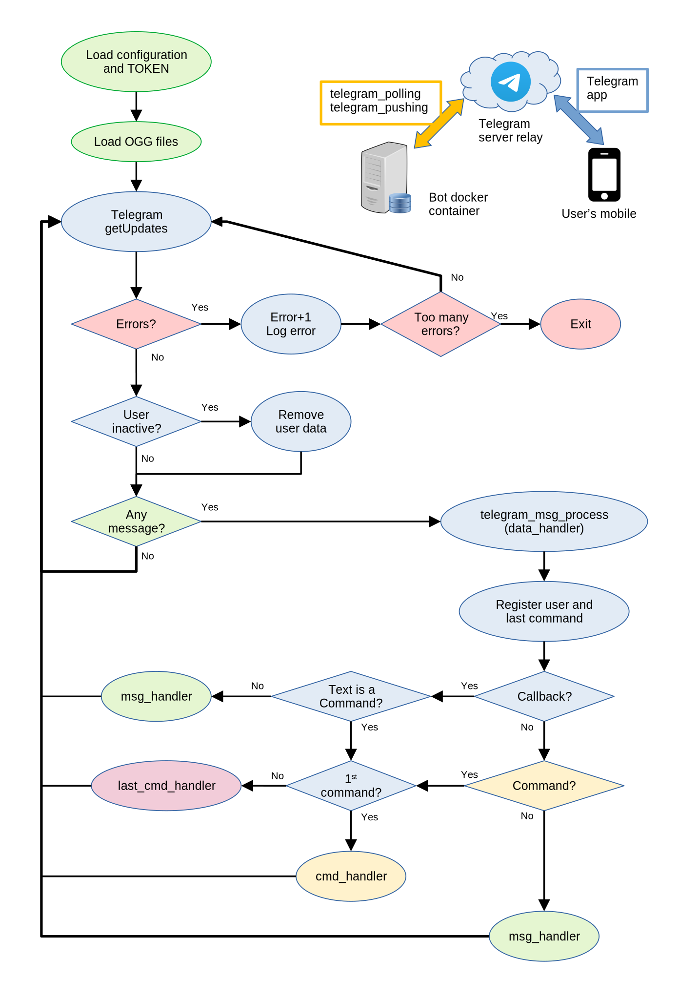
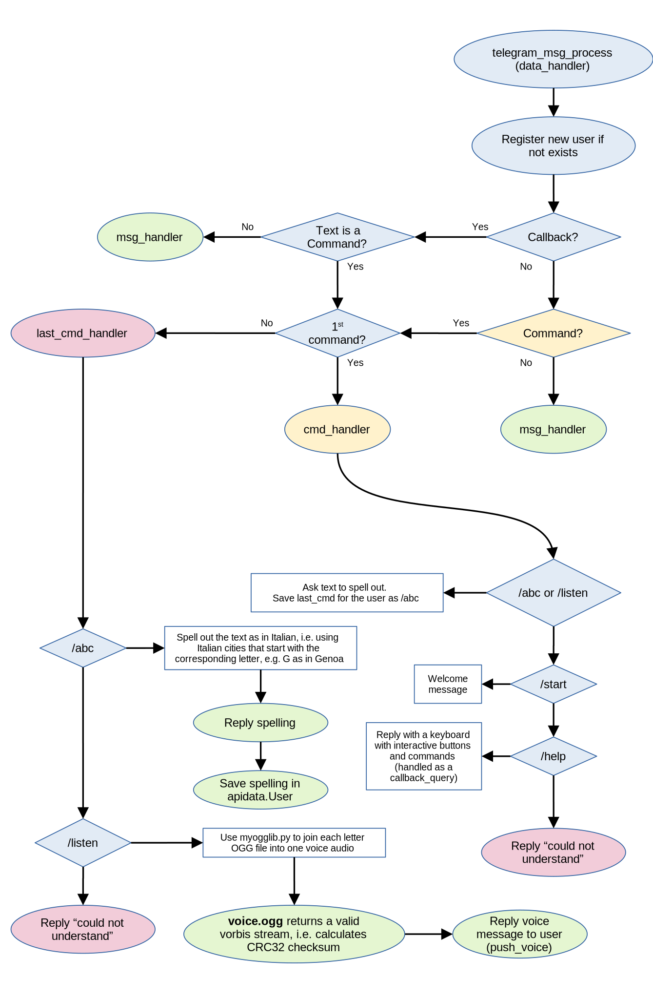
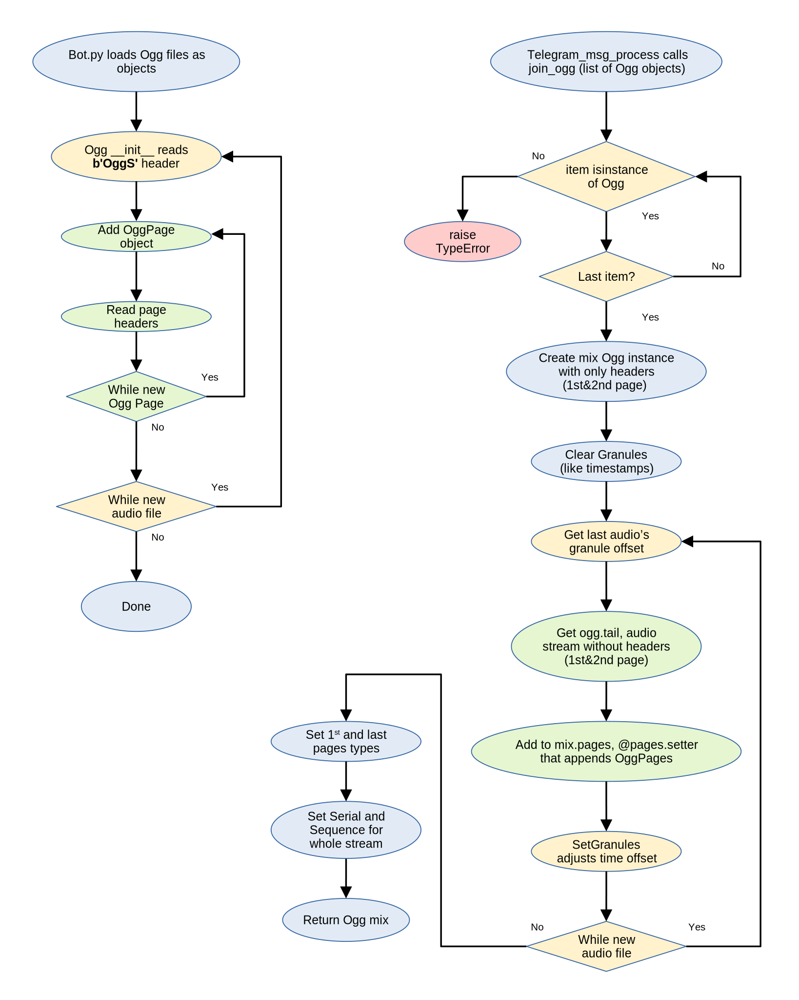

# Italian Phonetic Alphabet - a Telegram Bot
## _by Lucas Gonzalez Zan_


 


This is a Telegram Bot designed to spell out using Italian cities and output a voice message with the spelling in Italian.

 

Scan to try live or follow: https://t.me/ItalianAlphabetbot

## Features

The bot accepts the following commands from any Telegram chat:

- /start 	---	Welcome message
- /help  	---	Bring up in-line keyboard with commands
- /abc  	---	Ask for text to spell out [^1]
- /listen --- Generate voice reply from last spelling [^2]
- /info --- Return this source code link


[^1]: Uses the dictionary defined in "apidata", non [A-Z] characters are ignored 
[^2]: The ogg files in /audios are joint (with headers recalculated) 


 


## Usage

 ```
TOKEN=1234567890:ABCDEFGHIJKMNLOPQRSTUVXYZabcdefghij 
export TOKEN
python bot.py
```

Output log:
> 2022-03-16 17:03:28,297 - root - DEBUG - Payload is: {'ok': True, 'result': []} Status is: 200 <br/>
> 2022-03-16 17:03:28,297 - root - INFO - No messages to process. <br/>
> 2022-03-16 17:04:27,464 - root - INFO - Processing 1 menssages, last update_id was 441657297 <br/>
> 2022-03-16 17:04:27,464 - telegram_msg_process - DEBUG - Last command was: None <br/>

Logging is saved in "rotating.bot.log" which rotate logs every 2MB into a new file. Optionally, we can set the debugging level via the environment variable:
``` 
LOGLVL = DEBUG
export LOGLVL
```


## Tech

No special modules are needed, only an updated release of python for new features, such as `case`:

- python-3.10.2

The ogg files are joint by the `myogg` library, a custom class which splits ogg pages and headers. A joint valid stream is delivered by recalculating ogg headers and checksums. 

## Docker

Requires `python:3.10-alpine3.17` or higher.
In Dockerfile update your telegram token:
ENV TOKEN="1234567890:ABCDEFGHIJKMNLOPQRSTUVXYZabcdefghij"

```
sudo docker build -t italianalphabetbot . 
sudo docker run -d --name italianalphabetbot_1 italianalphabetbot 
```

## Workflow

### Workflow bot.py
 The main process constantly polls telegrams servers for new messages. For each message, the data_handler in telegram_msg_process takes the request and answers to the corresponding user, via telegram's API.

  

### Workflow telegram_msg_process.py
Telegram's API has different message types:
- Simple text message
- Command message, these start with '/'
- Callback query, these result from touching a graphic keyboard in the app (see InlineKeyboardButton [^3])

[^3]: InlineKeyboardButton represents a button structure in the app, see docs https://core.telegram.org/bots/api#inlinekeyboardbutton 

Finally, some commands need further information from the user. The app saves the user's ID.



### Workflow myogglib.py
In the main process we call a new instance of Ogg class for every audio file. Each file containst the spelling of the letter with and example city starting with that letter. <br/>
Upon a /listen command, the app needs to join the audios into a single Ogg stream, and then send this via API to Telegrams as a voice package. For this, the Ogg class' methods read the stream of bytes and separates headers and pages in different objects. Then, it joins the corresponding parts under a single stream with the headers of every Ogg object updated. 




## License

**It's Free Software :)**
